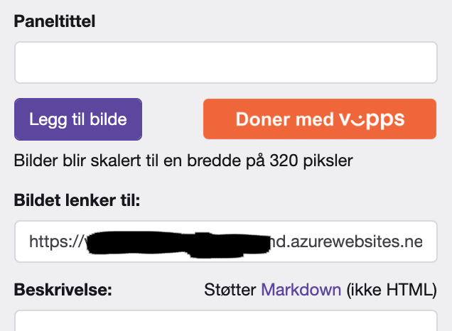
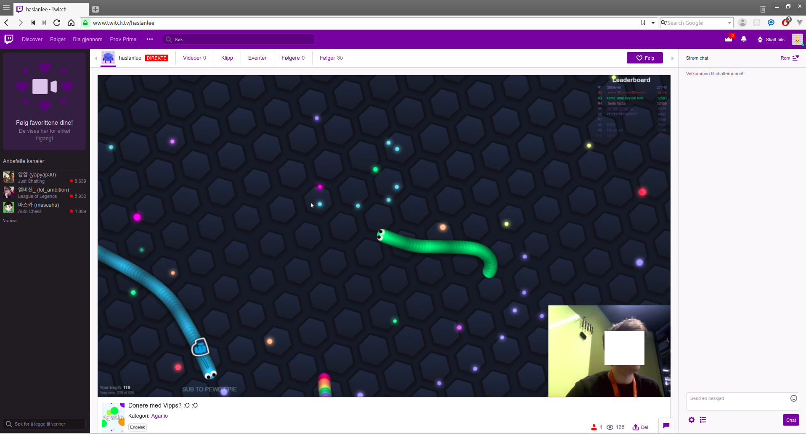
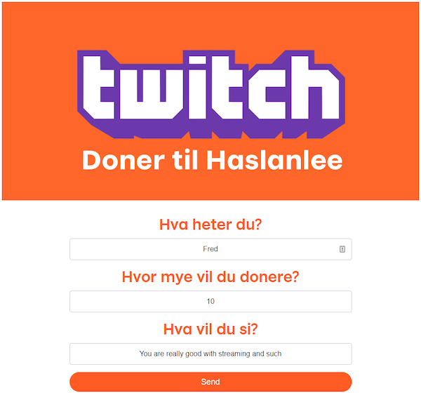
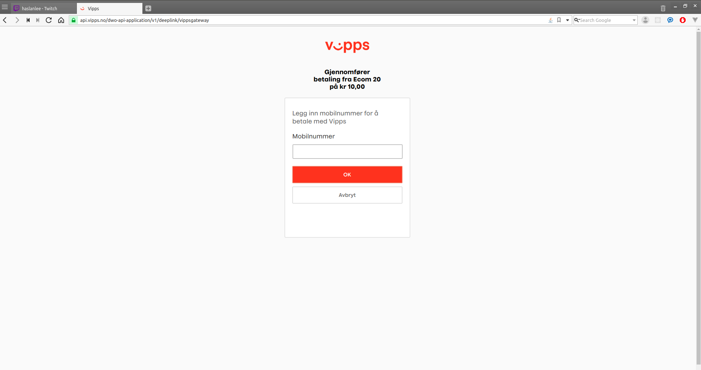
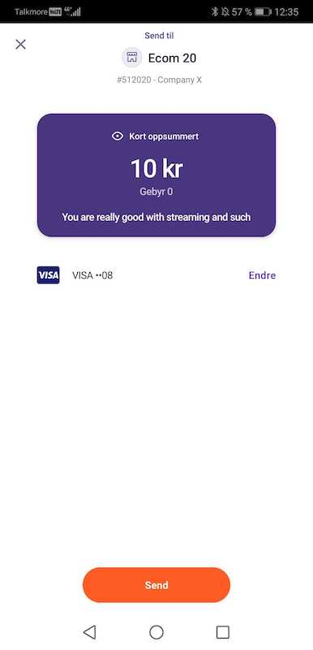
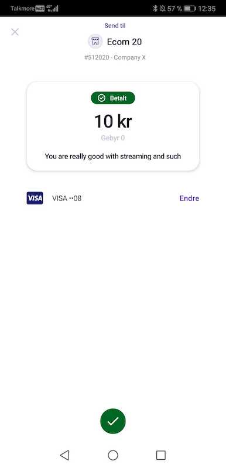
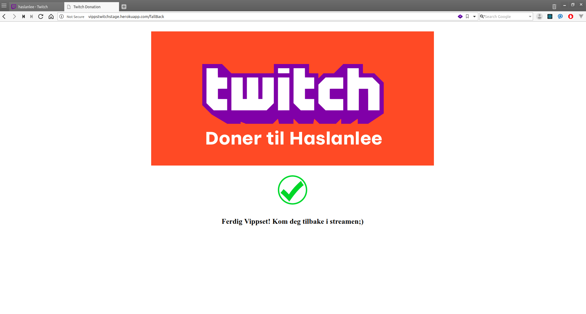
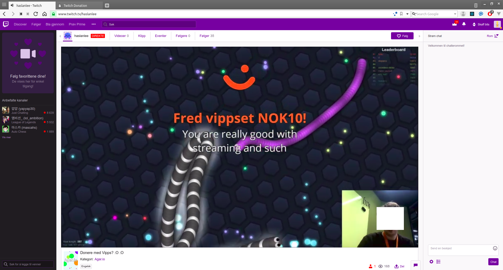

# Vipps for Streamlabs


This is a quick hack from an internal Vipps hackathon. **No guarantees whatsoever!**
We're always happy to help, but please not that this is not an officially supported 
Vipps solution, and we have to prioritize customers using official products.
Still:[Issues](issues) and [PRs](pulls) are welcome!

This hack is an integration between [Vipps](https://vipps.no) and [Streamlabs](https://streamlabs.com).

Read about why we made this "hack" in this article on [Medium](https://medium.com/@ariddervold/vipps-for-streamlabs-8133fb204f8e)


This is a
[Spring Boot](https://spring.io/projects/spring-boot)
Java application
and
[React Express.js](https://reactjs.org)
which integrates with the
[Vipps eCom v2 API](https://github.com/vippsas/vipps-ecom-api)
and
[Streamlabs API](https://dev.streamlabs.com/reference).

This was useful for us:
* [Getting started with Spring Boot](https://spring.io/guides/gs/spring-boot/).
* [Getting started with React.js](https://reactjs.org/docs/getting-started.html)
* [Getting started with Vipps](https://vipps.no/produkter-og-tjenester/bedrift/ta-betalt-paa-nett/ta-betalt-paa-nett/#kom-i-gang-med-vipps-pa-nett-category-4)

# How to run this yourself on Heroku

## Prerequisites

* [Vipps På Nett](https://vippsbedrift.no/signup/vippspanett/), which requires a company with a Norwegian organisation number. [Enkeltpersonforetak](https://www.altinn.no/starte-og-drive/starte/valg-av-organisasjonsform/enkeltpersonforetak/) is sufficient.
* Accesstoken for your Streamlabs account (not necessary to test the flow. if you don't have it now fill in a gibberish string when asked to)

## Setup Heroku

1. Install Heroku CLI from https://devcenter.heroku.com/articles/getting-started-with-nodejs#set-up

2. Login to Heroku
```bash
heroku login
```


## Deploy code to Heroku
1. Clone Server repository
```bash
git clone <repo>
```

2. Cd into repo
```bash
cd /vipps-streamlabs
```

3. Replace the image in application with your own

Replace `stream-profile-picture.png` in the `/frontend/public/img` directory
with your own. Height and width should be equal for best appearance.

4. Cd into backend folder and init git
```bash
~/vipps-streamlabs$ cd ../backend
```

```bash
~/backend$ git init
```
5. Create Heroku App for server. You need to keep the URL for the herokuapp for further steps
```bash
~/backend$ heroku create
```

This will return a URL for the created app back. We need this to configure our Server.
In this case http://sharp-rain-backend-921.herokuapp.com/

```bash
Creating sharp-rain-backend-921... done, stack is heroku-18
http://sharp-rain-backend-921.herokuapp.com/ | https://git.heroku.com/sharp-rain-backend-921.git
Git remote heroku added
```

6. Create a Heroko Postgres addon
```bash
~/backend$ heroku addons:create heroku-postgresql:hobby-dev
```

7. Cd into frontend folder and init git
```bash
~/backend$ cd ../frontend
```
```bash
~/frontend$ git init
```

8. Create Heroku App for the frontend. You need to keep the URL for the
herokuapp for further steps

```bash
~/frontend$ heroku create
```

This will return a URL for the created app back. We need this in later steps.
In this case http://sharp-rain-frontend-812.herokuapp.com/

```bash
Creating sharp-rain-frontend-812... done, stack is heroku-18
http://sharp-rain-frontend-812.herokuapp.com/ | https://git.heroku.com/sharp-rain-frontend-812.git
Git remote heroku added
```

9. Set environment variables in `application.yaml`, which is located in
`/backend/src/main/resources`.

The `TRANSACTION_TEXT` is what that will be shown to user when approving payment in Vipps.

```bash
STREAMLABS_ACCESS_TOKEN: sZW6Hpr4FeDETTEerIKKeKorrektTAYOHzCqqbRBqGb
STREAMLABS_CLIENT_ID: 123
STREAMLABS_CLIENT_SECRET: 123x<t>
VIPPS_CALLBACK_PREFIX: http://sharp-rain-backend-921.herokuapp.com/
VIPPS_CLIENT_ID: 1cca1cae-f88c-4f09-a6fb-770b7b17a6e2
VIPPS_CLIENT_SECRET: MmRIbkVCSzNHb0pXemdZOEhiMjA=
VIPPS_FALLBACK_URL: http://sharp-rain-frontend-812.herokuapp.com/fallback
VIPPS_MERCHANT_SERIAL_NUMBER: 50001
VIPPS_OCP_APIM_SUBSCRIPTION_KEY_ACCESSTOKEN: efee30IKKEGYLDIG87faab3
VIPPS_OCP_APIM_SUBSCRIPTION_KEY_ECOMMERCE: d85f2HEISANNSVE3616c646ccf
TRANSACTION_TEXT: "Donasjon til Streamer"
STREAMER_NAME: "Streamer"

```

10. Set `SERVER_URL` in frontend directory

In `/frontend/src/server/routes/paymentApi.js` in line 5, change variable
`SERVER_URL` to the URL for backend app. In this example: http://sharp-rain-backend-921.herokuapp.com/

11. Deploy both apps to Heroku

Deploy Server:
```bash
~/backend$ git add .
```

```bash
~/backend$ git commit -m "initial commit"
```

```bash
~/backend$ git push heroku master
```

Cd into frontend

```bash
~/backend$ cd ../frontend
```

Deploy frontend

```bash
~/frontend$ git add .
```

```bash
~/frontend$ git commit -m "initial commit"
```

```bash
~/frontend$ git push heroku master
```


## Test your application

When both apps is deployed successfully, go to the frontend URL.
From there you will be able to do donations.


## Add init donate button to streamers channel description on Twitch

In order to let people use your application and hopefully donate, you'll need
to share link to the frontend application to them. You can share a link in
cleartext or choose to place a button somewhere that will take the user to your
application. For example in the streamer's description on Twitch.

### Vipps donate button


### Screenshot from Twitch



* Upload the image that should be visible in the Twitch description to initiate Vipps donation
* Change "Bilde lenker til" to your hostname or IP address.


# Technical documentation


## Vipps API

* Get access token: [`POST:/accesstoken/get`](https://vippsas.github.io/vipps-ecom-api/#/Authorization%20Service/fetchAuthorizationTokenUsingPost)
* Initiate payment: [`POST:/ecomm/v2/payments`](https://vippsas.github.io/vipps-ecom-api/#/Vipps%20eCom%20API/initiatePaymentV3UsingPOST)
* Listen for callback on a successful, or unsuccesful, payment in the Vipps app ([`POST:[callbackPrefix]/v2/payments/{orderId}`](https://vippsas.github.io/vipps-ecom-api/#/Endpoints%20required%20by%20Vipps%20from%20the%20merchant/transactionUpdateCallbackForRegularPaymentUsingPOST)).

**Please note**: This is NOT made to be a reference implementation.

We make the code available here, in case it may be useful for others.
[Issues](issues) and [PRs](pulls) are welcome!

## Streamlabs API

* If a callback from Vipps API was successful, it triggered a `POST` request to
the Streamlabs [`POST:/donations`](https://dev.streamlabs.com/reference#donations-1)
endpoint. The streamer then has to configure in the admin panel how the donation will be
shown in the stream.

## Flow

### Actors used below

* Vipps = Vipps API
* Streamlabs = Streamlabs API
* Server = Spring Boot App
* Frontend = React Express.js App
* Streamer = Human streaming on Twitch
* User = Human watching Streamer



This is the normal view of a stream on Twitch.


## Donate button in streamers channel description


The Vipps donate button is shown. Streamers are free to include whatever in
their channel/stream description.

1. User is watching a streamer on Twitch
2. User click "Donér med Vipps"-button

## Frontend Landing page



Clicking the Vipps button sends the user to this page.

3. User is redirected to frontend and is showed a form
4. User fills in name, message to streamer and amount
5. Frontend sends form data to server. Amount in USD is converted to NOK before sent to Vipps.
6. Server saves the donation in a DB and initiate payment with Vipps that responds with URL that user need to approve in Vipps app


## Vipps landing page



The standard Vipps landing page, where the user enters his/her phone number and confirms the donation.

7. If user is on mobile, user is redirected to Vipps app to approve. If desktop, user will be redirected to a Vipps landing page first to approve it's phone number which will trigger a push notification on users phone.

## Payment request in the Vipps app



The payment request in the Vipps app.

8. User approve or decline payment in the Vipps app
9. Vipps sends callback to server with order status (`FAILED`, `SUCCESS`, `CANCELLED`)
10. Server then update the donation in the DB.
11. If order status is SUCCESS server notify Streamlabs with a POST request

## Payment confirmation in the Vipps app



The green "Betalt" bubble shows that the payment was successful.

## Success



Confirmation of the successful Vipps donation.

12. User is redirected to /fallback/{orderId} in frontend
13. Frontend then asks server what the status is for the donation. If server haven't recieved any callback from Vipps, it does a /getPaymentDetails request to Vipps before replying to the frontend.
14. fallback page on frontend is rendered Based on `FAILED`, `SUCCESS` or `CANCELLED` in server response


## Donation shown on stream



Donation shown on the stream.
Our backend received successful callback which trigger "/donations" POST-request to Streamlabs.

# Questions?

We're always happy to help, but please not that this is not an officially supported Vipps solution.
[Issues](issues) and [PRs](pulls) are welcome!
