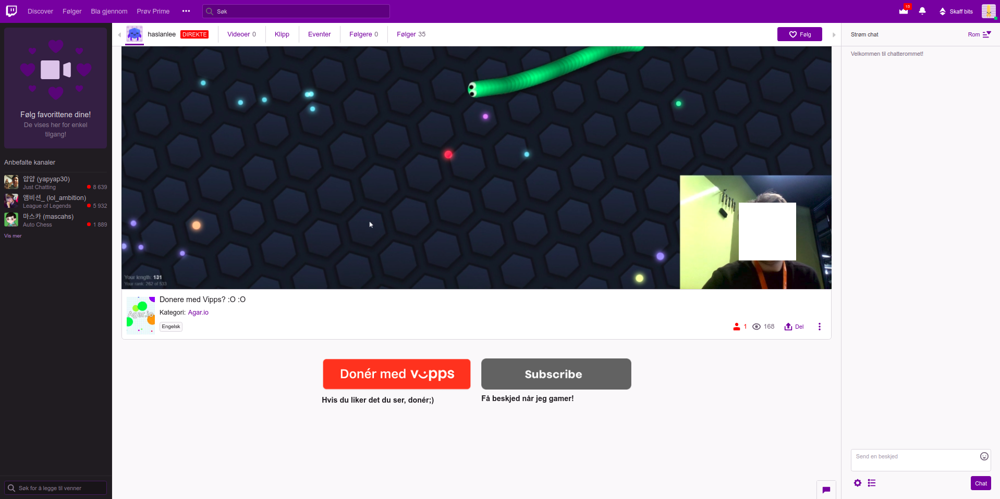

# Vipps for Streamlabs

:warning: This is a quick hack from an internal Vipps hackathon. No guarantees whatsoever! :boom: :fire: :shit:

The hackathon team:
* Asbjørn Riddervold ([GitHub](https://github.com/aridder), [LinkedIn](https://www.linkedin.com/in/ariddervold/))
* Henrik Wille ([LinkedIn](https://www.linkedin.com/in/hwille/))
* Håkon Strøm Lie ([GitHub](https://github.com/Hakonslie), [LinkedIn](https://www.linkedin.com/in/hakonslie/))

There is a write-up of this hack on [Medium](https://medium.com/@ariddervold/vipps-for-streamlabs-8133fb204f8e) :clap:

# What you need try this out

* A company. This can be an [Enkeltpersonforetak](https://www.brreg.no/enkeltpersonforetak/registrere-et-enkeltpersonforetak/), which is free and  easy to establish. Vipps is required by regulation to perform checks of all customers ([KYC](https://en.wikipedia.org/wiki/Know_your_customer), [AML](https://en.wikipedia.org/wiki/Money_laundering), etc), and this requires a company.
* "Vipps på Nett", the Vipps eCommerce solution, which can be ordered [here](https://www.vipps.no/bedrift/vipps-pa-nett). Select "direct integration". You will need [BankID](https://www.bankid.no/privat/) to sign the order. The API keys for the test environment should arrive shortly, and the API keys for production in a few days (after KYC, AML, etc).

## Coding

You also need to be able to code a _little_ bit, or get help from someone who can.

This is a
[Spring Boot](https://spring.io/projects/spring-boot)
Java application which integrates with the
[Vipps eCom v2 API](https://github.com/vippsas/vipps-ecom-api)
and
[Streamlabs API](https://dev.streamlabs.com/reference).

Two important files:
* [`VippsService.java`](https://github.com/vippsas/vipps-streamlabs/blob/master/src/main/java/no/vipps/twitchecom/VippsService.java)
* [`VippsController.java`](https://github.com/vippsas/vipps-streamlabs/blob/master/src/main/java/no/vipps/twitchecom/VippsController.java)

This was useful for Spring Boot:
* [Getting started with Spring Boot](https://spring.io/guides/gs/spring-boot/).
* [Validating Form Input](https://spring.io/guides/gs/validating-form-input/).

# What we did

We decided to just focus on the key features in our solution. Just the minimal
to get something up and running:

* Create a backend that is integrated with [Vipps’ API for B2C/eCom payments](https://github.com/vippsas/vipps-ecom-api).
This included payment initiation and listening for callbacks from
successful/unsuccessful payments attempts. The backend also had to communicate
with Streamlabs. Streamlabs is a streaming software that allows you to broadcast
your video to Twitch and other services. Streamlabs has an open API that
we used. We used the specific endpoint: [`POST:/donations`](https://dev.streamlabs.com/reference#donations-1).

* Create a Vipps “donate” button that the streamer could place in their channel
description or somewhere else. This button would trigger a Vipps payment
(payment initiation) and open a landing page where the viewer fills in a donation amount,
a text that is showed, and optionally a GIF of choice.

* Create a frontend where the viewer could enter amount to donate, message to
be displayed, and name to be showed as sender. This data is then submitted to
the backend, which replies with a redirect URL to the Vipps landing page.

We hosted both the backend and frontend on [Heroku](https://www.heroku.com).
Heroku was a pleasant experience for hosting. Both easy and cheap (free).

## Vipps API

This hack uses the [Vipps eCom v2 API](https://github.com/vippsas/vipps-ecom-api) is used,
and all documentation, Swagger files, Postman collections, etc is available on GitHub.

* Get access token: [`POST:/accesstoken/get`](https://vippsas.github.io/vipps-ecom-api/#/Authorization%20Service/fetchAuthorizationTokenUsingPost)
* Initiate payment: [`POST:/ecomm/v2/payments`](https://vippsas.github.io/vipps-ecom-api/#/Vipps%20eCom%20API/initiatePaymentV3UsingPOST)
* Listen for callback on a successful, or unsuccessful, payment in the Vipps app ([`POST:[callbackPrefix]/v2/payments/{orderId}`](https://vippsas.github.io/vipps-ecom-api/#/Endpoints%20required%20by%20Vipps%20from%20the%20merchant/transactionUpdateCallbackForRegularPaymentUsingPOST)).

**Please note**: [Refunds](https://vippsas.github.io/vipps-ecom-api/#/Vipps%20eCom%20API/refundPaymentUsingPOST),
[Get Payment Details](https://vippsas.github.io/vipps-ecom-api/#/Vipps%20eCom%20API/getPaymentDetailsUsingGET)
and more is not implemented.
This is just _bare minimum_ implementation for the hackathon.
We make the code available here, in case it may be useful for others.

## Streamlabs API

The Streamlabs API is very well documented on [dev.streamlabs.com](https://dev.streamlabs.com).
For this hack, we use it this way:

If a callback from Vipps API was successful, it triggered a POST request to
the Streamlabs [`POST:/donations`](https://dev.streamlabs.com/reference#donations-1)
endpoint. The streamer then has to configure in the admin panel how the donation will be
shown in the stream.

In the StreamlabService class there is a _hardcoded_ accesstoken passed from
[`application.properties`](https://github.com/vippsas/vipps-streamlabs/blob/master/src/main/resources/application.properties).
Streamlabs informed us that this had no expiry date,
so we got the access token when testing in [Postman](https://www.getpostman.com)
and copied into the properties file.

# Screenshots

The following screenshots show the complete flow, from displaying the donate button,
via the Vipps payment, to showing the donation message on the stream.

## Streaming view

This is the normal view of a stream on Twitch.
Håkon is playing the addictive game [slither.io](http://slither.io).

## Donate button

The Vipps donate button is shown.
Streamers are free to include whatever they want in their channel/stream description.

## Landing page

Clicking the Vipps button sends the user to this page.
See the Vipps [design guidelines](https://github.com/vippsas/vipps-design-guidelines).

## Vipps landing page

The standard Vipps landing page, where the user enters his/her phone number
and confirms the donation.

## Payment request in the Vipps app

The payment request in the Vipps app. The user enters amount (10 kr)
and text ("You are really good with streaming and such"), and presses "Send".

## Payment confirmation in the Vipps app

The green "Betalt" bubble shows that the payment was successful.

## Success

Confirmation of the successful Vipps donation.

## Donation shown on stream

Donation shown on the stream.
Our backend received successful callback which trigger "/donations" POST-request to Streamlabs.

# Questions?

We're always happy to help, but please not that this is not an officially supported Vipps solution.
[Issues](issues) and [PRs](pulls) are welcome!
